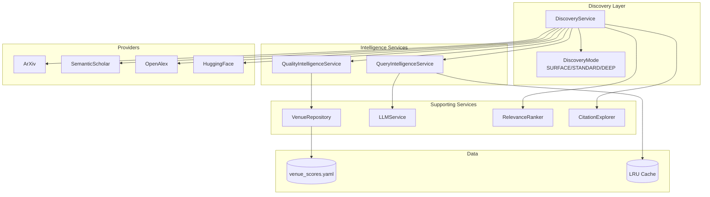
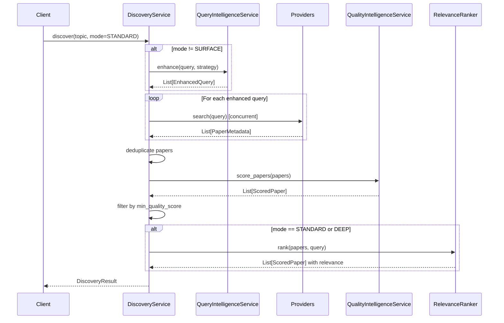

# Design Document: Intelligence Services Consolidation

## Overview

This design document details the technical implementation for consolidating the fragmented quality scoring and discovery orchestration systems into two unified services:

1. **QualityIntelligenceService** - Unified quality scoring (Requirements R1-R8)
2. **QueryIntelligenceService** - Unified query enhancement (Requirement D1)
3. **Unified Discovery API** - Tiered discovery with `discover()` entry point (Requirements D2-D6)

These services form the foundation for consistent, predictable behavior across all discovery pipelines and enable Phase 8 DRA (Deep Research Agent) development.

## Steering Document Alignment

### Technical Standards (tech.md)
- **Python 3.14+**: All new code uses modern Python features
- **Pydantic V2**: All models use strict validation with `ConfigDict`
- **Structlog**: Structured JSON logging for observability
- **Type Hints**: Full type annotations enforced by mypy
- **Testing**: ≥99% coverage with pytest

### Project Structure (structure.md)
- Services placed in `src/services/`
- Models placed in `src/models/`
- Tests mirror source structure in `tests/unit/services/`

## Code Reuse Analysis

### Existing Components to Leverage

| Component | Location | Reuse Strategy |
|-----------|----------|----------------|
| `QualityWeights` | `src/models/discovery.py` | Use directly (already 6-signal) |
| `ScoredPaper` | `src/models/discovery.py` | Use as output model |
| `DiscoveryResult` | `src/models/discovery.py` | Extend with new fields |
| `DecomposedQuery` | `src/models/discovery.py` | Migrate to EnhancedQuery |
| `venue_scores.yaml` | `src/data/venue_scores.yaml` | Single source of truth |
| `LLMService` | `src/services/llm/` | Inject for query enhancement |

### Integration Points

| System | Integration |
|--------|-------------|
| `DiscoveryService` | Inject QualityIntelligenceService, use discover() |
| `EnhancedDiscoveryService` | Deprecated, functionality merged |
| `DiscoveryPhase` | Call discover() with mode based on config |
| `RelevanceRanker` | Continues to use LLM for relevance scoring |

## Architecture

### High-Level Component Diagram



### Discovery Flow Sequence



## Components and Interfaces

### Component 1: QualityIntelligenceService

**Purpose:** Unified quality scoring for papers with 6 configurable signals

**File:** `src/services/quality_intelligence_service.py`

**Interfaces:**
```python
class QualityIntelligenceService:
    def __init__(
        self,
        weights: Optional[QualityWeights] = None,
        venue_repository: Optional[VenueRepository] = None,
        min_citations: int = 0,
    ) -> None: ...

    # Primary API
    def score_paper(self, paper: PaperMetadata) -> ScoredPaper: ...
    def score_papers(self, papers: List[PaperMetadata]) -> List[ScoredPaper]: ...
    def filter_by_quality(
        self, papers: List[PaperMetadata], min_score: float = 0.3
    ) -> List[ScoredPaper]: ...
    def get_tier(self, score: float) -> str: ...

    # Legacy compatibility (deprecated)
    def score_legacy(self, paper: PaperMetadata) -> float: ...  # Returns 0-100
    def rank_papers_legacy(
        self, papers: List[PaperMetadata], min_score: float = 0.0
    ) -> List[PaperMetadata]: ...
    def filter_and_score(
        self, papers: List[PaperMetadata], weights: Optional[QualityWeights] = None
    ) -> List[ScoredPaper]: ...

    # Private scoring methods
    def _calculate_citation_score(self, paper: PaperMetadata) -> float: ...
    def _calculate_influential_bonus(self, paper: PaperMetadata) -> float: ...
    def _calculate_venue_score(self, paper: PaperMetadata) -> float: ...
    def _calculate_recency_score(self, paper: PaperMetadata) -> float: ...
    def _calculate_engagement_score(self, paper: PaperMetadata) -> float: ...
    def _calculate_completeness_score(self, paper: PaperMetadata) -> float: ...
    def _calculate_author_score(self, paper: PaperMetadata) -> float: ...
```

**Dependencies:**
- `VenueRepository` (injected) - Loads venue scores from YAML
- `QualityWeights` (from models) - Weight configuration
- `structlog` - Logging

**Reuses:**
- `QualityWeights` model from `src/models/discovery.py`
- `ScoredPaper` model from `src/models/discovery.py` (ensure `frozen=True` for immutability)
- Venue YAML structure from existing `venue_scores.yaml`

**Design Note - Influential Citation Handling (SR Review #1):**
> The "influential citation bonus" is a provider-specific signal. Only **Semantic Scholar** returns `influential_citation_count` in its API response. For papers from other providers (ArXiv, OpenAlex, HuggingFace), the influential citation count will be `0` or `None`.
>
> **Implementation Rule:** When `influential_citation_count` is `0`, `None`, or unavailable, the influential bonus SHALL be `0.0` (neutral). This ensures papers are not penalized or biased based on provider-specific metadata availability.
>
> ```python
> def _calculate_influential_bonus(self, paper: PaperMetadata) -> float:
>     """Calculate influential citation bonus (Semantic Scholar only)."""
>     count = getattr(paper, 'influential_citation_count', 0) or 0
>     if count <= 0:
>         return 0.0  # Neutral for non-SS providers
>     return min(0.1, count * 0.01)
> ```

---

### Component 2: VenueRepository

**Purpose:** Load, cache, and query venue quality scores from YAML

**File:** `src/services/venue_repository.py`

**Interfaces:**
```python
class VenueRepository(Protocol):
    def get_score(self, venue: str) -> float: ...
    def get_default_score(self) -> float: ...
    def reload(self) -> None: ...

class YamlVenueRepository:
    def __init__(
        self,
        yaml_path: Optional[Path] = None,
        default_score: float = 0.5,
    ) -> None: ...

    def get_score(self, venue: str) -> float: ...
    def get_default_score(self) -> float: ...
    def reload(self) -> None: ...

    def _normalize_venue(self, venue: str) -> str: ...
    def _load_venues(self) -> Dict[str, float]: ...
```

**Dependencies:**
- `yaml` - YAML parsing
- `pathlib.Path` - File path handling

**Reuses:**
- Existing `venue_scores.yaml` file structure
- Normalization logic from `QualityFilterService._normalize_venue()`

---

### Component 3: QueryIntelligenceService

**Purpose:** Unified query enhancement with decompose, expand, and hybrid strategies

**File:** `src/services/query_intelligence_service.py`

**Interfaces:**
```python
class QueryStrategy(str, Enum):
    DECOMPOSE = "decompose"  # Break into focused sub-queries
    EXPAND = "expand"        # Generate semantic variants
    HYBRID = "hybrid"        # Decompose then expand each

class QueryIntelligenceService:
    def __init__(
        self,
        llm_service: Optional[LLMService] = None,
        cache_enabled: bool = True,
        max_cache_size: int = 1000,
    ) -> None: ...

    async def enhance(
        self,
        query: str,
        strategy: QueryStrategy = QueryStrategy.DECOMPOSE,
        max_queries: int = 5,
        include_original: bool = True,
    ) -> List[EnhancedQuery]: ...

    async def decompose(
        self, query: str, max_subqueries: int = 5
    ) -> List[EnhancedQuery]: ...

    async def expand(
        self, query: str, max_variants: int = 5
    ) -> List[EnhancedQuery]: ...

    def _get_cache_key(
        self, query: str, strategy: str, max_queries: int, llm_model: str
    ) -> str: ...
    def _evict_lru(self) -> None: ...
```

**Design Note - Cache Key Strategy (SR Review #2):**
> The cache key MUST include the LLM model identifier to prevent stale expansions when the user changes LLM providers. If the LLM changes (e.g., from Claude to Gemini), cached query expansions from the previous model would be semantically different.
>
> **Cache Key Format:** `{normalized_query_hash}:{strategy}:{max_queries}:{llm_model}`
>
> ```python
> def _get_cache_key(
>     self, query: str, strategy: str, max_queries: int, llm_model: str
> ) -> str:
>     """Generate cache key including LLM model for consistency."""
>     query_hash = hashlib.sha256(query.lower().strip().encode()).hexdigest()[:12]
>     return f"{query_hash}:{strategy}:{max_queries}:{llm_model}"
> ```
>
> When `llm_service` is `None` (graceful degradation), use `"none"` as the model identifier.
```

**Dependencies:**
- `LLMService` (injected) - For query generation
- `OrderedDict` - LRU cache implementation

**Reuses:**
- LLM prompts from `QueryDecomposer` (focus area generation)
- LLM prompts from `QueryExpander` (variant generation)
- Caching pattern from `QueryDecomposer`

---

### Component 4: Unified DiscoveryService.discover()

**Purpose:** Single entry point for all discovery operations with tiered modes

**File:** `src/services/discovery/service.py` (extend existing)

**Interfaces:**
```python
class DiscoveryMode(str, Enum):
    SURFACE = "surface"    # Fast, single provider
    STANDARD = "standard"  # Balanced, query decomposition
    DEEP = "deep"          # Comprehensive, citations

class DiscoveryService:
    # NEW: Primary entry point
    async def discover(
        self,
        topic: ResearchTopic,
        mode: DiscoveryMode = DiscoveryMode.STANDARD,
        config: Optional[DiscoveryPipelineConfig] = None,
        llm_service: Optional[LLMService] = None,
    ) -> DiscoveryResult: ...

    # DEPRECATED: Legacy methods (route to discover())
    async def search(...) -> List[PaperMetadata]: ...
    async def enhanced_search(...) -> DiscoveryResult: ...
    async def multi_source_search(...) -> List[PaperMetadata]: ...

    # Private mode implementations
    async def _discover_surface(
        self, topic: ResearchTopic, config: DiscoveryPipelineConfig
    ) -> DiscoveryResult: ...

    async def _discover_standard(
        self, topic: ResearchTopic, config: DiscoveryPipelineConfig, llm: LLMService
    ) -> DiscoveryResult: ...

    async def _discover_deep(
        self, topic: ResearchTopic, config: DiscoveryPipelineConfig, llm: LLMService
    ) -> DiscoveryResult: ...
```

**Dependencies:**
- `QualityIntelligenceService` (injected)
- `QueryIntelligenceService` (injected)
- `RelevanceRanker` (existing)
- `CitationExplorer` (existing)
- All providers (existing)

## Data Models

### Model 1: EnhancedQuery (New)

```python
class EnhancedQuery(BaseModel):
    """Unified query representation for all enhancement strategies."""

    model_config = ConfigDict(frozen=True)

    query: str = Field(..., min_length=1, max_length=500, description="Query text")
    focus: Optional[QueryFocus] = Field(None, description="Focus area if decomposed")
    weight: float = Field(1.0, ge=0.0, le=2.0, description="Weight for result merging")
    is_original: bool = Field(False, description="True for the original query")
    parent_query: Optional[str] = Field(None, description="Parent if expanded from decomposition")
    strategy_used: QueryStrategy = Field(..., description="Strategy that generated this query")
```

### Model 2: DiscoveryMode (New)

```python
class DiscoveryMode(str, Enum):
    """Discovery complexity modes."""

    SURFACE = "surface"    # Fast: single provider, no enhancement
    STANDARD = "standard"  # Balanced: decomposition, all providers, quality filter
    DEEP = "deep"          # Comprehensive: hybrid, citations, relevance ranking
```

### Model 3: DiscoveryPipelineConfig (New)

```python
class DiscoveryPipelineConfig(BaseModel):
    """Unified configuration for all discovery modes."""

    model_config = ConfigDict(frozen=True)

    # Mode selection
    mode: DiscoveryMode = Field(DiscoveryMode.STANDARD)

    # Provider configuration
    providers: List[ProviderType] = Field(
        default=[ProviderType.ARXIV, ProviderType.SEMANTIC_SCHOLAR,
                 ProviderType.OPENALEX, ProviderType.HUGGINGFACE]
    )
    provider_timeout_seconds: float = Field(30.0, ge=1.0, le=300.0)
    fallback_enabled: bool = Field(True)

    # Query enhancement
    query_strategy: QueryStrategy = Field(QueryStrategy.DECOMPOSE)
    max_queries: int = Field(5, ge=1, le=20)
    include_original_query: bool = Field(True)

    # Citation exploration (DEEP only)
    citation_forward_enabled: bool = Field(True)
    citation_backward_enabled: bool = Field(True)
    max_citations_per_paper: int = Field(10, ge=1, le=50)

    # Quality filtering
    min_quality_score: float = Field(0.3, ge=0.0, le=1.0)
    min_citations: int = Field(0, ge=0)
    quality_weights: Optional[QualityWeights] = Field(None)

    # Relevance filtering (STANDARD and DEEP)
    enable_relevance_ranking: bool = Field(True)
    min_relevance_score: float = Field(0.5, ge=0.0, le=1.0)
    relevance_batch_size: int = Field(10, ge=1, le=50)

    # Result limits
    max_papers: int = Field(50, ge=1, le=500)
```

### Model 4: Extended DiscoveryResult

```python
class DiscoveryResult(BaseModel):
    """Extended result with mode and source tracking."""

    model_config = ConfigDict(extra="forbid")

    papers: List[ScoredPaper] = Field(default_factory=list)
    metrics: DiscoveryMetrics = Field(default_factory=DiscoveryMetrics)
    queries_used: List[EnhancedQuery] = Field(default_factory=list)  # Changed type
    source_breakdown: Dict[str, int] = Field(default_factory=dict)  # NEW
    mode: DiscoveryMode = Field(DiscoveryMode.STANDARD)  # NEW
```

### Model 5: QualityTierConfig (New)

```python
class QualityTierConfig(BaseModel):
    """Configurable quality tier thresholds."""

    model_config = ConfigDict(frozen=True)

    excellent_threshold: float = Field(0.80, ge=0.0, le=1.0)
    good_threshold: float = Field(0.60, ge=0.0, le=1.0)
    fair_threshold: float = Field(0.40, ge=0.0, le=1.0)
    # Below fair_threshold = "low"

    @model_validator(mode="after")
    def validate_thresholds_descending(self) -> "QualityTierConfig":
        if not (self.excellent_threshold > self.good_threshold > self.fair_threshold):
            raise ValueError("Thresholds must be in descending order: excellent > good > fair")
        return self
```

## Error Handling

### Error Scenarios

1. **Venue YAML Not Found**
   - **Handling:** Log warning, use empty dict with default score (0.5)
   - **User Impact:** All papers get default venue score; scoring continues

2. **Venue YAML Parse Error**
   - **Handling:** Log error with details, use empty dict with default score
   - **User Impact:** Same as not found; degraded but functional

3. **LLM Service Unavailable**
   - **Handling:** Return original query only with `is_original=True`
   - **User Impact:** No query enhancement; discovery continues with single query

4. **LLM Response Parse Error**
   - **Handling:** Log warning, return original query as fallback
   - **User Impact:** Same as unavailable; graceful degradation

5. **Provider Timeout**
   - **Handling:** Log warning, continue with other providers
   - **User Impact:** Fewer papers from failed provider; partial results

6. **All Providers Failed**
   - **Handling:** Return empty DiscoveryResult with error in metrics
   - **User Impact:** No papers; clear error indication

7. **Invalid Weights Configuration**
   - **Handling:** Raise `ValueError` with clear message
   - **User Impact:** Immediate failure; must fix configuration

8. **Paper Missing Required Fields**
   - **Handling:** Use default scores (0.5) for missing optional fields
   - **User Impact:** Paper scored with degraded accuracy; no crash

## Testing Strategy

### Unit Testing

**QualityIntelligenceService Tests** (`tests/unit/services/test_quality_intelligence_service.py`):
- Score calculation for each signal (citation, venue, recency, engagement, completeness, author)
- Weight validation (sum to 1.0)
- Tier classification (excellent, good, fair, low)
- Legacy method compatibility
- Graceful handling of missing fields
- Deterministic scoring (same input = same output)

**VenueRepository Tests** (`tests/unit/services/test_venue_repository.py`):
- YAML loading and parsing
- Venue normalization (lowercase, remove digits, common words)
- Exact match vs substring match priority
- Default score for unknown venues
- Cache behavior and reload

**QueryIntelligenceService Tests** (`tests/unit/services/test_query_intelligence_service.py`):
- Decompose strategy (5 sub-queries with focus areas)
- Expand strategy (semantic variants)
- Hybrid strategy (decompose then expand)
- LRU cache eviction
- Graceful degradation without LLM
- Include original query option

**DiscoveryService.discover() Tests** (`tests/unit/services/discovery/test_discover.py`):
- SURFACE mode (single provider, no enhancement)
- STANDARD mode (decomposition, all providers, quality filter)
- DEEP mode (hybrid, citations, relevance)
- Legacy method routing with deprecation warnings
- Configuration validation
- Error handling for provider failures

### Integration Testing

**Quality + Discovery Integration** (`tests/integration/test_quality_discovery_integration.py`):
- End-to-end discovery with quality scoring
- Score consistency across modes
- Metrics accuracy

**Query Enhancement + Providers** (`tests/integration/test_query_provider_integration.py`):
- Enhanced queries sent to all providers
- Result deduplication across queries
- Source tracking accuracy

### End-to-End Testing

**Full Pipeline E2E** (`tests/e2e/test_discovery_pipeline_e2e.py`):
- Real provider queries (mocked in CI, live in staging)
- Real LLM calls for query enhancement
- Complete DiscoveryResult validation
- Performance benchmarks per mode

## File Structure

```
src/
├── services/
│   ├── quality_intelligence_service.py   # NEW: R1-R8
│   ├── venue_repository.py               # NEW: R2 support
│   ├── query_intelligence_service.py     # NEW: D1
│   ├── discovery/
│   │   └── service.py                    # MODIFIED: Add discover()
│   ├── quality_scorer.py                 # DEPRECATED (Phase 4)
│   ├── quality_filter_service.py         # DEPRECATED (Phase 4)
│   ├── query_decomposer.py               # DEPRECATED (Phase 4)
│   └── ...
├── utils/
│   └── query_expander.py                 # DEPRECATED (Phase 4)
├── models/
│   ├── discovery.py                      # MODIFIED: Add new models
│   └── ...
├── data/
│   └── venue_scores.yaml                 # MODIFIED: Update ArXiv to 15
└── ...

tests/
├── unit/
│   └── services/
│       ├── test_quality_intelligence_service.py  # NEW
│       ├── test_venue_repository.py              # NEW
│       ├── test_query_intelligence_service.py    # NEW
│       └── discovery/
│           └── test_discover.py                  # NEW
├── integration/
│   ├── test_quality_discovery_integration.py     # NEW
│   └── test_query_provider_integration.py        # NEW
└── e2e/
    └── test_discovery_pipeline_e2e.py            # NEW
```

## Implementation Order

### Phase 1: Foundation (Non-Breaking)
1. Create `VenueRepository` with YAML loading and normalization
2. Create `QualityIntelligenceService` with all scoring methods
3. Create `QueryIntelligenceService` with all strategies
4. Update `venue_scores.yaml` (ArXiv → 15)
5. Add comprehensive unit tests (≥99% coverage)

### Phase 2: Integration (Non-Breaking)
1. Add `DiscoveryMode` enum and `DiscoveryPipelineConfig`
2. Implement `discover()` method in DiscoveryService
3. Wire up QualityIntelligenceService and QueryIntelligenceService
4. Add integration tests

### Phase 3: Compatibility Layer
1. Update `search()` to route to `discover(SURFACE)` with deprecation warning
2. Update `enhanced_search()` to route to `discover(STANDARD)` with deprecation warning
3. Update `multi_source_search()` to route to `discover(DEEP)` with deprecation warning
4. Update `DiscoveryPhase` to use `discover()`

**Design Note - ArXiv Score Migration Audit (SR Review #3):**
> **CRITICAL AUDIT REQUIREMENT:** The ArXiv venue score is changing from 0.60 (hardcoded in QualityFilterService) to 0.50 (YAML normalized). This affects the **STANDARD** discovery mode which previously used `enhanced_search()`.
>
> **Migration Checklist:**
> - [ ] Audit all hardcoded `min_quality_score` thresholds in codebase that may have been tuned to the 0.60 ArXiv baseline
> - [ ] Audit any config files or environment variables with quality thresholds
> - [ ] Verify `DiscoveryPhase` default thresholds are appropriate for the new 0.50 ArXiv score
> - [ ] Update any documentation referencing ArXiv quality scores
> - [ ] Run comparative analysis: same queries through old vs new scoring to quantify ranking changes
>
> **Impact Assessment:** Papers from ArXiv will score ~17% lower on the venue component (0.50 vs 0.60). Since venue weight is 0.20, the overall score impact is approximately **-2%** (0.10 × 0.20 = 0.02). This is intentional—the previous 0.60 was considered too lenient compared to peer-reviewed venues.

### Phase 4: Cleanup (Breaking - Phase 9)
1. Remove `QualityScorer` class
2. Remove `QualityFilterService` class
3. Remove `QueryDecomposer` class
4. Remove `QueryExpander` class
5. Remove legacy methods from `QualityIntelligenceService`
6. Remove deprecated discovery methods
