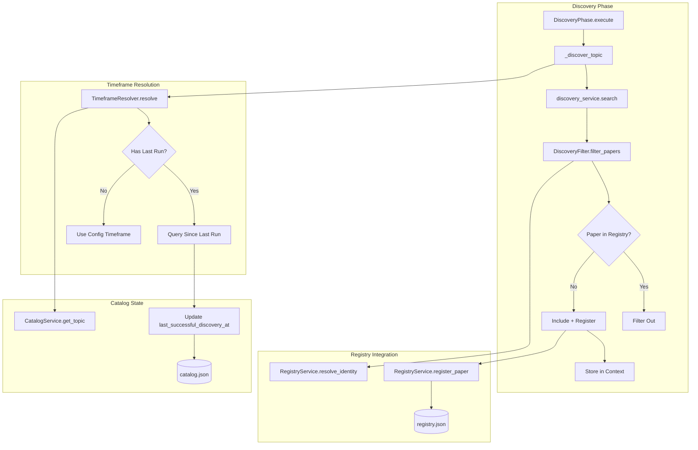

# Design Document: Phase 7.1 - Discovery Foundation

## Overview

Phase 7.1 implements foundational improvements to the paper discovery pipeline to eliminate duplicate papers and enable incremental discovery. This design integrates with the existing `RegistryService`, `DiscoveryPhase`, and `CatalogService` to add:

1. **Discovery-time filtering** against the registry
2. **Incremental timeframe resolution** based on last successful run
3. **Discovery-time paper registration** for cross-run deduplication
4. **Enhanced discovery statistics** for observability

## Steering Document Alignment

### Technical Standards (tech.md)
- **Pydantic V2**: All new models use strict Pydantic validation
- **Async/Await**: Discovery filtering integrates with existing async pipeline
- **Structured Logging**: Uses `structlog` for all new log messages
- **Type Hints**: Full type coverage with mypy validation

### Project Structure (structure.md)
- New utilities in `src/utils/` for timeframe resolution
- New filter class in `src/services/` following existing service patterns
- Models in `src/models/` following existing Pydantic conventions

## Code Reuse Analysis

### Existing Components to Leverage

- **`RegistryService`** (`src/services/registry_service.py`): Already provides `resolve_identity()` for DOI/ArXiv/title matching - will be used for filtering
- **`CatalogService`** (`src/services/catalog_service.py`): Manages `catalog.json` - will be extended to store `last_successful_discovery_at`
- **`DiscoveryPhase`** (`src/orchestration/phases/discovery.py`): Main discovery orchestration - will integrate filtering
- **`PipelineContext`** (`src/orchestration/context.py`): Carries services through pipeline - already has `registry_service`
- **`hash.py`** (`src/utils/hash.py`): Title normalization and similarity - reused for deduplication

### Integration Points

- **DiscoveryPhase._discover_topic()**: Insert filtering after `discovery_service.search()`
- **CatalogService**: Add `last_successful_discovery_at` field to topic entries
- **PipelineResult**: Add discovery statistics to result object
- **NotificationService**: Include new/filtered counts in Slack messages

## Architecture



### Modular Design Principles

- **Single File Responsibility**: `DiscoveryFilter` handles only filtering logic
- **Component Isolation**: `TimeframeResolver` is a standalone utility
- **Service Layer Separation**: Filtering uses `RegistryService` without modifying it
- **Utility Modularity**: New utilities are focused and single-purpose

## Components and Interfaces

### Component 1: DiscoveryFilter

**File:** `src/services/discovery_filter.py`

- **Purpose:** Filter discovered papers against the registry to remove duplicates
- **Interfaces:**
  ```python
  class DiscoveryFilter:
      def __init__(self, registry_service: RegistryService)

      async def filter_papers(
          self,
          papers: List[PaperMetadata],
          topic_slug: str,
          register_new: bool = True,
      ) -> DiscoveryFilterResult:
          """Filter papers and optionally register new ones."""

      def _check_duplicate(self, paper: PaperMetadata) -> Optional[str]:
          """Check if paper is duplicate, return match method if so."""
  ```
- **Dependencies:** `RegistryService`, `PaperMetadata`
- **Reuses:** `RegistryService.resolve_identity()`, `hash.normalize_title()`

### Component 2: TimeframeResolver

**File:** `src/utils/timeframe_resolver.py`

- **Purpose:** Resolve query timeframe based on last successful run or config
- **Interfaces:**
  ```python
  class TimeframeResolver:
      def __init__(self, catalog_service: CatalogService)

      def resolve(
          self,
          topic: ResearchTopic,
          topic_slug: str,
      ) -> ResolvedTimeframe:
          """Resolve timeframe for a topic query."""

      def update_last_run(
          self,
          topic_slug: str,
          timestamp: datetime,
      ) -> None:
          """Update last successful discovery timestamp."""
  ```
- **Dependencies:** `CatalogService`, `ResearchTopic`
- **Reuses:** Existing timeframe models from `src/models/config.py`

### Component 3: DiscoveryFilterResult (Model)

**File:** `src/models/discovery.py`

- **Purpose:** Hold filtering results with statistics
- **Interfaces:**
  ```python
  class DiscoveryFilterResult(BaseModel):
      new_papers: List[PaperMetadata]
      filtered_papers: List[FilteredPaper]
      stats: DiscoveryStats

  class FilteredPaper(BaseModel):
      paper: PaperMetadata
      filter_reason: str  # "doi", "arxiv", "title", "provider_id"
      matched_entry_id: str

  class DiscoveryStats(BaseModel):
      total_discovered: int
      new_count: int
      filtered_count: int
      filter_breakdown: Dict[str, int]  # {"doi": 5, "title": 2, ...}
  ```
- **Dependencies:** `PaperMetadata`
- **Reuses:** Pydantic patterns from existing models

### Component 4: CatalogService Extension

**File:** `src/services/catalog_service.py` (modify existing)

- **Purpose:** Add discovery timestamp tracking to catalog entries
- **New Methods:**
  ```python
  def get_last_discovery_at(self, topic_slug: str) -> Optional[datetime]:
      """Get last successful discovery timestamp for topic."""

  def set_last_discovery_at(self, topic_slug: str, timestamp: datetime) -> None:
      """Set last successful discovery timestamp for topic."""

  def detect_query_change(self, topic: ResearchTopic, topic_slug: str) -> bool:
      """Detect if topic query has changed since last run."""
  ```
- **Dependencies:** Existing `CatalogTopic` model
- **Reuses:** Existing `catalog.json` persistence

## Data Models

### CatalogTopic Extension

```python
class CatalogTopic(BaseModel):
    topic_slug: str
    query: str
    folder: str
    runs: List[CatalogRun]
    # NEW FIELDS
    last_successful_discovery_at: Optional[datetime] = None
    query_hash: Optional[str] = None  # For change detection
```

### ResolvedTimeframe

```python
class ResolvedTimeframe(BaseModel):
    """Resolved timeframe for a discovery query."""
    start_date: datetime
    end_date: datetime
    is_incremental: bool  # True if based on last run
    overlap_buffer_hours: int = 1
    original_timeframe: Optional[Timeframe] = None
```

### DiscoveryStats

```python
class DiscoveryStats(BaseModel):
    """Statistics from discovery filtering."""
    total_discovered: int
    new_count: int
    filtered_count: int
    filter_breakdown: Dict[str, int] = Field(default_factory=dict)
    incremental_query: bool = False
    query_start_date: Optional[datetime] = None
```

## Error Handling

### Error Scenarios

1. **Registry Load Failure**
   - **Handling:** Log error, create empty registry, continue with no filtering
   - **User Impact:** All papers treated as new (safe fallback)

2. **Registry Save Failure**
   - **Handling:** Log error, retry once, continue pipeline (non-blocking)
   - **User Impact:** Duplicates may appear in next run

3. **Catalog Corruption**
   - **Handling:** Create backup, reset to empty state, log warning
   - **User Impact:** Full timeframe query for all topics (one-time)

4. **Identity Resolution Timeout**
   - **Handling:** Skip filtering for batch, log warning
   - **User Impact:** Some duplicates may pass through

## Testing Strategy

### Unit Testing

- `test_discovery_filter.py`:
  - Test DOI-based filtering
  - Test ArXiv ID filtering
  - Test title similarity filtering (boundary cases)
  - Test registration of new papers
  - Test stats calculation

- `test_timeframe_resolver.py`:
  - Test incremental resolution with last run
  - Test fallback to config timeframe
  - Test overlap buffer calculation
  - Test query change detection

### Integration Testing

- `test_discovery_phase_integration.py`:
  - Test full discovery with filtering enabled
  - Test filtering disabled via config
  - Test registry persistence across runs
  - Test catalog timestamp updates

### End-to-End Testing

- `test_daily_run_e2e.py`:
  - Run pipeline twice with same topic
  - Verify second run filters duplicates
  - Verify new papers are discovered
  - Verify stats in pipeline result

## Configuration

```yaml
# research_config.yaml additions
settings:
  discovery_filter:
    enabled: true  # Toggle filtering
    register_at_discovery: true  # Register papers immediately
    verbose_logging: false  # Log each filtered paper

  incremental_discovery:
    enabled: true  # Use last run timestamp
    overlap_buffer_hours: 1  # Safety overlap
    reset_on_query_change: true  # Reset timestamp if query changes
```

## Implementation Order

1. **Models** (`src/models/discovery.py`) - New data models
2. **TimeframeResolver** (`src/utils/timeframe_resolver.py`) - Timeframe logic
3. **CatalogService Extension** - Add timestamp methods
4. **DiscoveryFilter** (`src/services/discovery_filter.py`) - Core filtering
5. **DiscoveryPhase Integration** - Wire up filtering
6. **PipelineResult Extension** - Add stats
7. **NotificationService Update** - Include stats in Slack
8. **Tests** - Full test coverage

## Backward Compatibility

- All new features are opt-in via config flags
- Default behavior with `discovery_filter.enabled: false` matches current behavior
- Existing `registry.json` and `catalog.json` formats are extended, not replaced
- Migration: Existing entries work without `last_successful_discovery_at` field
