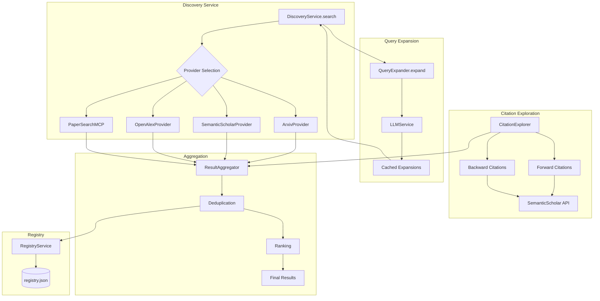

# Design Document: Phase 7.2 - Discovery Expansion

## Overview

Phase 7.2 expands paper discovery beyond single-source keyword queries by adding:

1. **OpenAlex provider** for broader academic coverage
2. **Paper Search MCP integration** for unified multi-source queries
3. **Citation network exploration** (forward and backward)
4. **Query expansion** using LLM-generated variants
5. **Multi-source aggregation** with intelligent ranking

This design extends the existing provider architecture to support multiple concurrent sources and citation-based discovery.

## Steering Document Alignment

### Technical Standards (tech.md)
- **Provider Pattern**: Follows existing `ProviderProtocol` interface
- **Async/Await**: All new providers are fully async
- **Pydantic V2**: New models use strict validation
- **Rate Limiting**: Respects API rate limits with backoff

### Project Structure (structure.md)
- New providers in `src/services/providers/`
- Citation explorer in `src/services/`
- Query expansion utility in `src/utils/`

## Code Reuse Analysis

### Existing Components to Leverage

- **`ProviderProtocol`** (`src/services/providers/base.py`): Interface for all providers
- **`ArxivProvider`** (`src/services/providers/arxiv.py`): Reference implementation
- **`SemanticScholarProvider`** (`src/services/providers/semantic_scholar.py`): SS API patterns
- **`DiscoveryService`** (`src/services/discovery_service.py`): Multi-provider orchestration
- **`RegistryService`**: Cross-source deduplication
- **`LLMService`** (`src/services/llm/`): For query expansion

### Integration Points

- **DiscoveryService.search()**: Add new providers to provider selection
- **ProviderSelector**: Update selection logic for new providers
- **DiscoveryPhase**: Integrate citation exploration
- **PipelineResult**: Add source breakdown statistics

## Architecture



### Modular Design Principles

- **Single File Responsibility**: Each provider in separate file
- **Component Isolation**: `CitationExplorer` is independent of providers
- **Service Layer Separation**: Aggregation logic separate from providers
- **Utility Modularity**: Query expansion is a reusable utility

## Components and Interfaces

### Component 1: OpenAlexProvider

**File:** `src/services/providers/openalex.py`

- **Purpose:** Search OpenAlex API for academic papers
- **Interfaces:**
  ```python
  class OpenAlexProvider(ProviderProtocol):
      def __init__(self, api_key: Optional[str] = None)

      async def search(
          self,
          topic: ResearchTopic,
          max_results: int = 50,
      ) -> List[PaperMetadata]:
          """Search OpenAlex for papers matching topic."""

      async def get_paper(self, openalex_id: str) -> Optional[PaperMetadata]:
          """Get single paper by OpenAlex ID."""

      def _map_to_metadata(self, work: dict) -> PaperMetadata:
          """Map OpenAlex work to PaperMetadata."""
  ```
- **Dependencies:** `pyalex`, `PaperMetadata`
- **Reuses:** Provider patterns from `ArxivProvider`

### Component 2: PaperSearchMCPProvider

**File:** `src/services/providers/paper_search_mcp.py`

- **Purpose:** Connect to Paper Search MCP server for multi-source queries
- **Interfaces:**
  ```python
  class PaperSearchMCPProvider(ProviderProtocol):
      def __init__(self, mcp_endpoint: str)

      async def search(
          self,
          topic: ResearchTopic,
          sources: List[str] = None,  # ["arxiv", "pubmed", "biorxiv", ...]
      ) -> List[PaperMetadata]:
          """Search via MCP server."""

      async def health_check(self) -> bool:
          """Check if MCP server is available."""
  ```
- **Dependencies:** MCP client, `PaperMetadata`
- **Reuses:** Provider interface patterns

### Component 3: CitationExplorer

**File:** `src/services/citation_explorer.py`

- **Purpose:** Explore citation networks for discovered papers
- **Interfaces:**
  ```python
  class CitationExplorer:
      def __init__(
          self,
          semantic_scholar_provider: SemanticScholarProvider,
          registry_service: RegistryService,
          config: CitationExplorationConfig,
      )

      async def explore(
          self,
          seed_papers: List[PaperMetadata],
          topic_slug: str,
      ) -> CitationExplorationResult:
          """Explore citations for seed papers."""

      async def get_forward_citations(
          self,
          paper: PaperMetadata,
          max_results: int = 10,
      ) -> List[PaperMetadata]:
          """Get papers that cite this paper."""

      async def get_backward_citations(
          self,
          paper: PaperMetadata,
          max_results: int = 10,
      ) -> List[PaperMetadata]:
          """Get papers cited by this paper."""
  ```
- **Dependencies:** `SemanticScholarProvider`, `RegistryService`
- **Reuses:** SS API patterns, registry deduplication

### Component 4: QueryExpander

**File:** `src/utils/query_expander.py`

- **Purpose:** Generate semantically related queries using LLM
- **Interfaces:**
  ```python
  class QueryExpander:
      def __init__(
          self,
          llm_service: LLMService,
          cache_service: CacheService,
      )

      async def expand(
          self,
          query: str,
          max_variants: int = 5,
      ) -> List[str]:
          """Generate expanded query variants."""

      def _get_cached_expansion(self, query: str) -> Optional[List[str]]:
          """Check cache for existing expansion."""
  ```
- **Dependencies:** `LLMService`, `CacheService`
- **Reuses:** Existing LLM and cache infrastructure

### Component 5: ResultAggregator

**File:** `src/services/result_aggregator.py`

- **Purpose:** Merge and rank results from multiple sources
- **Interfaces:**
  ```python
  class ResultAggregator:
      def __init__(
          self,
          registry_service: RegistryService,
          config: AggregationConfig,
      )

      async def aggregate(
          self,
          source_results: Dict[str, List[PaperMetadata]],
      ) -> AggregationResult:
          """Aggregate results from multiple sources."""

      def _deduplicate(
          self,
          papers: List[PaperMetadata],
      ) -> List[PaperMetadata]:
          """Remove duplicates across sources."""

      def _rank(
          self,
          papers: List[PaperMetadata],
      ) -> List[PaperMetadata]:
          """Rank papers by relevance score."""
  ```
- **Dependencies:** `RegistryService`, `PaperMetadata`
- **Reuses:** Registry identity resolution

## Data Models

### CitationExplorationConfig

```python
class CitationExplorationConfig(BaseModel):
    """Configuration for citation exploration."""
    enabled: bool = True
    forward: bool = True
    backward: bool = True
    max_forward_per_paper: int = 10
    max_backward_per_paper: int = 10
    max_citation_depth: int = 1
    respect_registry: bool = True  # Skip papers already in registry
```

### CitationExplorationResult

```python
class CitationExplorationResult(BaseModel):
    """Results from citation exploration."""
    forward_papers: List[PaperMetadata]
    backward_papers: List[PaperMetadata]
    stats: CitationStats

class CitationStats(BaseModel):
    seed_papers_count: int
    forward_discovered: int
    backward_discovered: int
    filtered_as_duplicate: int
    depth_reached: int
```

### AggregationConfig

```python
class AggregationConfig(BaseModel):
    """Configuration for result aggregation."""
    max_papers_per_topic: int = 50
    ranking_weights: RankingWeights = Field(default_factory=RankingWeights)

class RankingWeights(BaseModel):
    citation_count: float = 0.3
    recency: float = 0.3
    source_count: float = 0.2
    pdf_availability: float = 0.2
```

### AggregationResult

```python
class AggregationResult(BaseModel):
    """Results from aggregation."""
    papers: List[PaperMetadata]
    source_breakdown: Dict[str, int]
    total_raw: int
    total_after_dedup: int
    ranking_applied: bool
```

### PaperMetadata Extension

```python
# Add to existing PaperMetadata
class PaperMetadata(BaseModel):
    # ... existing fields ...

    # NEW FIELDS
    discovery_source: Optional[str] = None  # "arxiv", "semantic_scholar", "openalex", etc.
    discovery_method: Optional[str] = None  # "keyword", "forward_citation", "backward_citation", "expanded_query"
    source_count: int = 1  # Number of sources that found this paper
    ranking_score: Optional[float] = None  # Aggregation ranking score
```

## Error Handling

### Error Scenarios

1. **OpenAlex API Unavailable**
   - **Handling:** Log warning, continue with other providers
   - **User Impact:** Reduced coverage, no failure

2. **MCP Server Disconnected**
   - **Handling:** Fall back to direct provider queries
   - **User Impact:** Slower discovery, same coverage

3. **Citation API Rate Limited**
   - **Handling:** Exponential backoff, reduce batch size
   - **User Impact:** Slower citation exploration

4. **Query Expansion LLM Failure**
   - **Handling:** Use original query only, log warning
   - **User Impact:** No expanded queries for this run

5. **Aggregation Memory Overflow**
   - **Handling:** Stream results, limit batch size
   - **User Impact:** Slightly slower aggregation

## Testing Strategy

### Unit Testing

- `test_openalex_provider.py`:
  - Test search with various queries
  - Test metadata mapping
  - Test rate limit handling

- `test_citation_explorer.py`:
  - Test forward citation fetching
  - Test backward citation fetching
  - Test depth limiting
  - Test registry-based deduplication

- `test_query_expander.py`:
  - Test expansion generation
  - Test cache hit/miss
  - Test LLM failure handling

- `test_result_aggregator.py`:
  - Test cross-source deduplication
  - Test ranking algorithm
  - Test source breakdown stats

### Integration Testing

- `test_multi_source_discovery.py`:
  - Test discovery with all providers enabled
  - Test graceful degradation when providers fail
  - Test source breakdown accuracy

- `test_citation_integration.py`:
  - Test citation exploration with real SS API
  - Test integration with registry filtering

### End-to-End Testing

- `test_expanded_discovery_e2e.py`:
  - Run full pipeline with all Phase 7.2 features
  - Verify 2x paper discovery improvement
  - Verify citation network exploration
  - Verify query expansion effectiveness

## Configuration

```yaml
# research_config.yaml additions
settings:
  providers:
    - arxiv
    - semantic_scholar
    - openalex          # NEW
    - paper_search_mcp  # NEW (optional)

  provider_settings:
    openalex:
      api_key_env: OPENALEX_API_KEY  # Optional, for polite pool
      max_results: 100
    paper_search_mcp:
      endpoint: localhost:50051
      sources: [arxiv, pubmed, biorxiv, google_scholar]

  citation_exploration:
    enabled: true
    forward: true
    backward: true
    max_forward_per_paper: 10
    max_backward_per_paper: 10
    max_citation_depth: 1

  query_expansion:
    enabled: true
    max_variants: 5
    cache_expansions: true
    llm_model: gemini-1.5-flash  # Fast model for expansions

  aggregation:
    max_papers_per_topic: 50
    ranking_weights:
      citation_count: 0.3
      recency: 0.3
      source_count: 0.2
      pdf_availability: 0.2
```

## Implementation Order

1. **OpenAlexProvider** - New provider implementation
2. **PaperSearchMCPProvider** - MCP integration
3. **DiscoveryService Updates** - Add new providers to selection
4. **CitationExplorer** - Citation network traversal
5. **QueryExpander** - LLM-based expansion
6. **ResultAggregator** - Multi-source merging
7. **DiscoveryPhase Integration** - Wire up all components
8. **Statistics and Logging** - Source breakdown tracking
9. **Tests** - Full test coverage

## Dependencies on Phase 7.1

- `DiscoveryFilter` must be complete for cross-source deduplication
- `RegistryService` extensions for discovery-time registration
- `CatalogService` extensions for incremental timeframes

## Backward Compatibility

- New providers are opt-in via config
- Existing single-source behavior preserved when new providers disabled
- `PaperMetadata` extensions use optional fields with defaults
- No breaking changes to existing APIs
