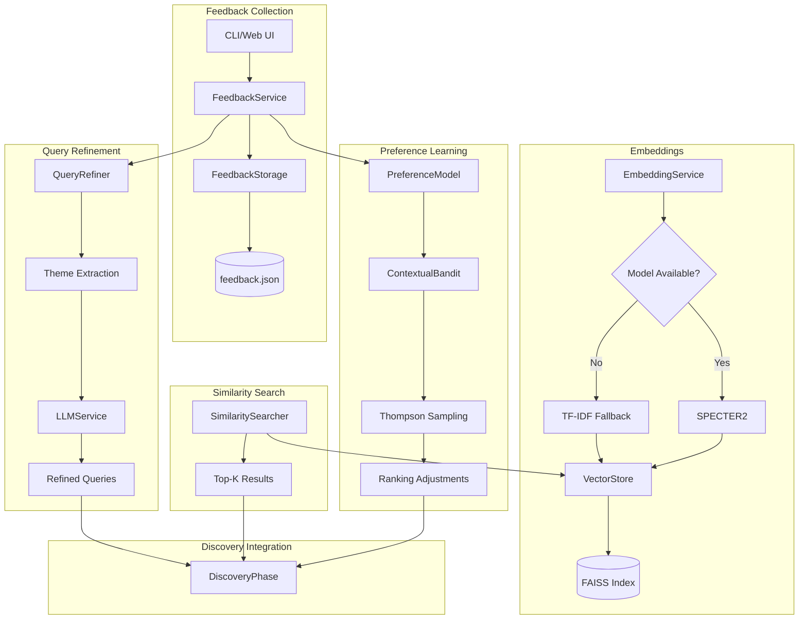

# Design Document: Phase 7.3 - Human Feedback Loop

## Overview

Phase 7.3 implements human-in-the-loop feedback to personalize paper discovery. This design adds:

1. **Feedback collection** - CLI and web UI for rating papers
2. **Feedback storage** - Persistent storage with structured reasons
3. **SPECTER2 embeddings** - Semantic paper similarity
4. **"Find more like this"** - Similarity search based on liked papers
5. **Preference learning** - Contextual bandits for personalization
6. **Query refinement** - Automatic query improvement from feedback

## Steering Document Alignment

### Technical Standards (tech.md)
- **Pydantic V2**: All feedback models use strict validation
- **Async/Await**: Embedding computation and similarity search are async
- **Structured Logging**: Feedback events logged for analytics
- **Graceful Degradation**: Works without SPECTER2 (falls back to TF-IDF)

### Project Structure (structure.md)
- Feedback service in `src/services/feedback/`
- Embedding service in `src/services/embeddings/`
- CLI commands in `src/cli/`
- Web UI in `src/ui/` (optional Gradio)

## Code Reuse Analysis

### Existing Components to Leverage

- **`RegistryService`**: Paper identity for feedback linking
- **`LLMService`**: For query refinement suggestions
- **`CacheService`**: For embedding caching
- **`hash.py`**: Title normalization utilities
- **`NotificationService`**: Feedback analytics in Slack

### Integration Points

- **DiscoveryPhase**: Apply preference-based ranking
- **CLI**: Add `feedback` command group
- **PipelineResult**: Include feedback-guided discovery stats
- **research_config.yaml**: Feedback configuration options

## Architecture



### Modular Design Principles

- **Single File Responsibility**: Separate services for feedback, embeddings, similarity
- **Component Isolation**: `PreferenceModel` independent of storage
- **Service Layer Separation**: UI layer separate from business logic
- **Utility Modularity**: Vector operations in dedicated utility

## Components and Interfaces

### Component 1: FeedbackService

**File:** `src/services/feedback/feedback_service.py`

- **Purpose:** Manage feedback collection, storage, and retrieval
- **Interfaces:**
  ```python
  class FeedbackService:
      def __init__(
          self,
          storage: FeedbackStorage,
          registry_service: RegistryService,
      )

      async def submit_feedback(
          self,
          paper_id: str,
          rating: FeedbackRating,  # thumbs_up, thumbs_down, neutral
          reasons: Optional[List[str]] = None,
          free_text: Optional[str] = None,
          topic_slug: Optional[str] = None,
      ) -> FeedbackEntry:
          """Submit feedback for a paper."""

      async def get_feedback_for_paper(
          self,
          paper_id: str,
      ) -> Optional[FeedbackEntry]:
          """Get existing feedback for a paper."""

      async def get_feedback_for_topic(
          self,
          topic_slug: str,
          rating_filter: Optional[FeedbackRating] = None,
      ) -> List[FeedbackEntry]:
          """Get all feedback for a topic."""

      async def get_analytics(
          self,
          topic_slug: Optional[str] = None,
      ) -> FeedbackAnalytics:
          """Generate feedback analytics report."""
  ```
- **Dependencies:** `FeedbackStorage`, `RegistryService`
- **Reuses:** Registry for paper identity validation

### Component 2: FeedbackStorage

**File:** `src/services/feedback/storage.py`

- **Purpose:** Persist feedback to disk with atomic writes
- **Interfaces:**
  ```python
  class FeedbackStorage:
      def __init__(self, storage_path: Path)

      async def save(self, entry: FeedbackEntry) -> None:
          """Save feedback entry."""

      async def load_all(self) -> List[FeedbackEntry]:
          """Load all feedback entries."""

      async def query(
          self,
          filters: FeedbackFilters,
      ) -> List[FeedbackEntry]:
          """Query feedback with filters."""

      async def archive_old_entries(
          self,
          threshold: int = 10000,
      ) -> int:
          """Archive entries beyond threshold."""
  ```
- **Dependencies:** `FeedbackEntry` model
- **Reuses:** Atomic write patterns from `RegistryService`

### Component 3: EmbeddingService

**File:** `src/services/embeddings/embedding_service.py`

- **Purpose:** Compute and cache paper embeddings
- **Interfaces:**
  ```python
  class EmbeddingService:
      def __init__(
          self,
          model_name: str = "allenai/specter2",
          cache_dir: Path = Path(".cache/embeddings"),
          fallback: str = "tfidf",
      )

      async def get_embedding(
          self,
          paper: PaperMetadata,
      ) -> np.ndarray:
          """Get embedding for a paper (cached)."""

      async def compute_embeddings_batch(
          self,
          papers: List[PaperMetadata],
      ) -> Dict[str, np.ndarray]:
          """Compute embeddings for multiple papers."""

      async def build_index(
          self,
          papers: List[PaperMetadata],
      ) -> None:
          """Build FAISS index for similarity search."""

      def _use_fallback(self) -> bool:
          """Check if fallback mode is needed."""
  ```
- **Dependencies:** `sentence-transformers`, `faiss`, `sklearn`
- **Reuses:** Cache patterns from `CacheService`

### Component 4: SimilaritySearcher

**File:** `src/services/embeddings/similarity_searcher.py`

- **Purpose:** Find similar papers using embeddings
- **Interfaces:**
  ```python
  class SimilaritySearcher:
      def __init__(
          self,
          embedding_service: EmbeddingService,
          registry_service: RegistryService,
      )

      async def find_similar(
          self,
          paper: PaperMetadata,
          top_k: int = 20,
          include_reasons: Optional[str] = None,
      ) -> List[SimilarPaper]:
          """Find papers similar to the given paper."""

      async def find_similar_to_liked(
          self,
          topic_slug: str,
          feedback_service: FeedbackService,
          top_k: int = 20,
      ) -> List[SimilarPaper]:
          """Find papers similar to all liked papers in topic."""
  ```
- **Dependencies:** `EmbeddingService`, `RegistryService`
- **Reuses:** Registry for paper lookup

### Component 5: PreferenceModel

**File:** `src/services/feedback/preference_model.py`

- **Purpose:** Learn user preferences from feedback
- **Interfaces:**
  ```python
  class PreferenceModel:
      def __init__(
          self,
          algorithm: str = "contextual_bandit",
          exploration_rate: float = 0.1,
      )

      async def train(
          self,
          feedback_entries: List[FeedbackEntry],
          paper_features: Dict[str, np.ndarray],
      ) -> None:
          """Train model on feedback data."""

      async def predict_preference(
          self,
          paper: PaperMetadata,
          features: np.ndarray,
      ) -> float:
          """Predict preference score for a paper."""

      async def rank_papers(
          self,
          papers: List[PaperMetadata],
          base_scores: Dict[str, float],
      ) -> List[PaperMetadata]:
          """Rank papers using preference + base scores."""

      def get_exploration_candidates(
          self,
          papers: List[PaperMetadata],
          n: int = 5,
      ) -> List[PaperMetadata]:
          """Select papers for exploration (Thompson Sampling)."""
  ```
- **Dependencies:** `vowpalwabbit` or custom implementation
- **Reuses:** Paper embeddings from `EmbeddingService`

### Component 6: QueryRefiner

**File:** `src/services/feedback/query_refiner.py`

- **Purpose:** Refine queries based on feedback patterns
- **Interfaces:**
  ```python
  class QueryRefiner:
      def __init__(
          self,
          llm_service: LLMService,
          feedback_service: FeedbackService,
      )

      async def analyze_feedback_themes(
          self,
          topic_slug: str,
          min_positive_feedback: int = 5,
      ) -> List[Theme]:
          """Extract common themes from liked papers."""

      async def suggest_refinements(
          self,
          topic: ResearchTopic,
          themes: List[Theme],
      ) -> List[QueryRefinement]:
          """Suggest query refinements based on themes."""

      async def apply_refinement(
          self,
          topic_slug: str,
          refinement: QueryRefinement,
      ) -> None:
          """Apply approved refinement to config."""
  ```
- **Dependencies:** `LLMService`, `FeedbackService`
- **Reuses:** LLM patterns from existing extraction

### Component 7: FeedbackCLI

**File:** `src/cli/feedback.py`

- **Purpose:** CLI commands for feedback management
- **Interfaces:**
  ```python
  @app.command()
  def rate(
      paper_id: str,
      rating: str,  # "up", "down", "neutral"
      reasons: Optional[List[str]] = None,
  ) -> None:
      """Rate a paper."""

  @app.command()
  def interactive() -> None:
      """Start interactive feedback session."""

  @app.command()
  def similar(paper_id: str, top_k: int = 10) -> None:
      """Find similar papers."""

  @app.command()
  def analytics(topic: Optional[str] = None) -> None:
      """Show feedback analytics."""

  @app.command()
  def export(format: str = "json", output: Path = None) -> None:
      """Export feedback data."""
  ```
- **Dependencies:** `typer`, `FeedbackService`
- **Reuses:** CLI patterns from existing `src/cli/`

## Data Models

### FeedbackEntry

```python
class FeedbackRating(str, Enum):
    THUMBS_UP = "thumbs_up"
    THUMBS_DOWN = "thumbs_down"
    NEUTRAL = "neutral"

class FeedbackReason(str, Enum):
    METHODOLOGY = "methodology"
    FINDINGS = "findings"
    APPLICATIONS = "applications"
    WRITING_QUALITY = "writing_quality"
    RELEVANCE = "relevance"
    NOVELTY = "novelty"

class FeedbackEntry(BaseModel):
    id: str = Field(default_factory=lambda: str(uuid.uuid4()))
    paper_id: str
    topic_slug: Optional[str] = None
    rating: FeedbackRating
    reasons: List[FeedbackReason] = Field(default_factory=list)
    free_text: Optional[str] = None
    timestamp: datetime = Field(default_factory=lambda: datetime.now(timezone.utc))

    model_config = ConfigDict(use_enum_values=True)
```

### SimilarPaper

```python
class SimilarPaper(BaseModel):
    paper: PaperMetadata
    similarity_score: float
    matching_aspects: List[str] = Field(default_factory=list)
    previously_discovered: bool = False
```

### FeedbackAnalytics

```python
class FeedbackAnalytics(BaseModel):
    total_ratings: int
    rating_distribution: Dict[str, int]
    top_reasons: List[tuple[str, int]]
    topic_breakdown: Dict[str, TopicAnalytics]
    trending_themes: List[str]
    recommendation_accuracy: Optional[float] = None

class TopicAnalytics(BaseModel):
    total: int
    thumbs_up: int
    thumbs_down: int
    neutral: int
    common_reasons: List[str]
```

### QueryRefinement

```python
class QueryRefinement(BaseModel):
    original_query: str
    refined_query: str
    rationale: str
    confidence: float
    themes_addressed: List[str]
    status: str = "pending"  # pending, accepted, rejected
```

## Error Handling

### Error Scenarios

1. **SPECTER2 Model Not Available**
   - **Handling:** Fall back to TF-IDF similarity
   - **User Impact:** Slightly less accurate similarity

2. **Feedback Storage Corruption**
   - **Handling:** Create backup, log error, continue with partial data
   - **User Impact:** Some feedback may be lost

3. **FAISS Index Build Failure**
   - **Handling:** Disable similarity search, log error
   - **User Impact:** "Find more like this" unavailable

4. **Preference Model Training Failure**
   - **Handling:** Use base ranking only, log warning
   - **User Impact:** No personalization for this run

5. **LLM Query Refinement Failure**
   - **Handling:** Skip refinement suggestions, log error
   - **User Impact:** No query suggestions this run

## Testing Strategy

### Unit Testing

- `test_feedback_service.py`:
  - Test feedback submission
  - Test retrieval by paper/topic
  - Test analytics generation

- `test_embedding_service.py`:
  - Test embedding computation
  - Test caching behavior
  - Test fallback to TF-IDF

- `test_similarity_searcher.py`:
  - Test similarity search accuracy
  - Test top-k retrieval
  - Test with reasons weighting

- `test_preference_model.py`:
  - Test training with feedback data
  - Test ranking predictions
  - Test exploration selection

### Integration Testing

- `test_feedback_integration.py`:
  - Test full feedback workflow
  - Test persistence across restarts
  - Test analytics accuracy

- `test_similarity_integration.py`:
  - Test similarity with real embeddings
  - Test integration with registry

### End-to-End Testing

- `test_feedback_e2e.py`:
  - Submit feedback via CLI
  - Verify similarity search improves
  - Verify preference learning affects ranking
  - Verify query refinement suggestions

## Configuration

```yaml
# research_config.yaml additions
settings:
  human_feedback:
    enabled: true
    storage_path: data/feedback.json
    archive_threshold: 10000

  embeddings:
    enabled: true
    model: allenai/specter2
    cache_dir: .cache/embeddings
    vector_db: faiss
    fallback: tfidf
    batch_size: 32

  preference_learning:
    enabled: true
    algorithm: contextual_bandit
    min_feedback_for_training: 20
    exploration_rate: 0.1
    update_frequency: daily
    blend_weight: 0.3  # Weight of preference vs base score

  query_refinement:
    enabled: true
    min_positive_feedback: 5
    auto_apply: false  # Require user approval
    cooldown_days: 30  # Days before re-suggesting rejected refinement

  feedback_ui:
    cli_enabled: true
    gradio_enabled: false
    gradio_port: 7860
```

## Implementation Order

1. **Data Models** - Feedback and analytics models
2. **FeedbackStorage** - Persistence layer
3. **FeedbackService** - Core feedback operations
4. **FeedbackCLI** - CLI commands
5. **EmbeddingService** - SPECTER2 integration
6. **SimilaritySearcher** - Vector similarity
7. **PreferenceModel** - Contextual bandits
8. **QueryRefiner** - LLM-based refinement
9. **DiscoveryPhase Integration** - Apply preferences
10. **Gradio UI** (optional) - Web interface
11. **Tests** - Full test coverage

## Dependencies on Phase 7.1 and 7.2

- `RegistryService` for paper identity linking
- `DiscoveryFilter` for avoiding duplicate recommendations
- `ResultAggregator` for preference-weighted ranking integration

## Backward Compatibility

- All feedback features are opt-in via config
- Pipeline works without feedback (no personalization)
- SPECTER2 is optional (TF-IDF fallback)
- CLI commands are additive, no changes to existing commands
- No changes to existing discovery behavior when disabled
